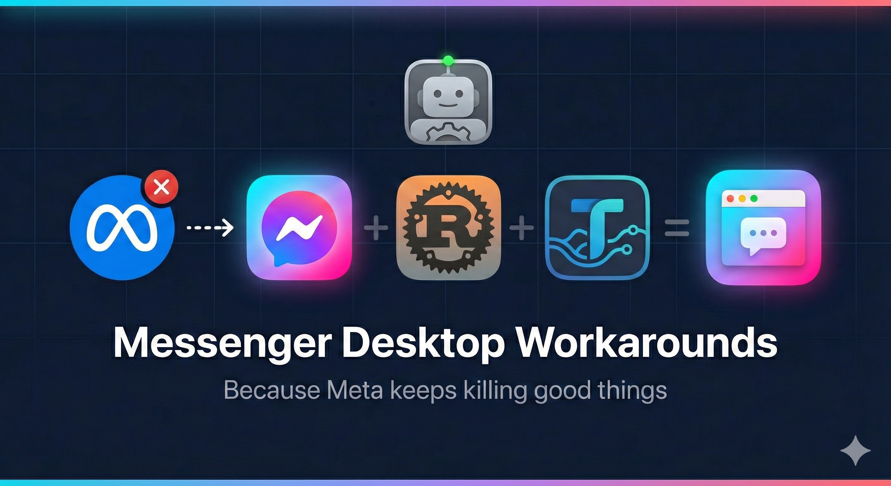
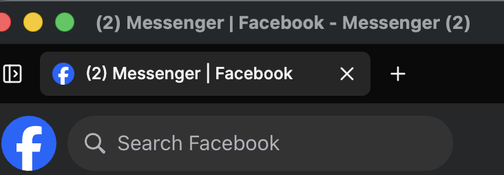
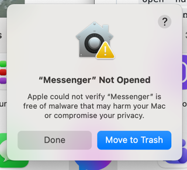

# FacebookMessengerWrapper(s)

Created Feb 17, 2026

Remember when Meta had a perfectly good desktop Messenger app? They killed it. 🪦 Messenger.com? On the chopping block too. 🔪 Apparently "a simple window where you send messages on your computer" was too radical a concept for a trillion-dollar company. 🤷

This repo is a collection of workarounds to get Messenger back as a standalone desktop app — a proper icon in your Dock, a clean browser window, no nonsense. 

------

## MacOS/OSX

### Option 1: Lightweight Wrapper

Wrapped inside Chromium using Webcatalog.io. This is the preferred installation method.

**Requirements:** 

- Facebook account
- MacOS Tahoe (Older versions may work, depending on Chromiums backward compatibility)
- Diskspace: 330 MB / RAM: ~100 MB

**Download**

https://github.com/davidyoh/FacebookMessengerWrappers/releases/download/v0.1.0-Slim/v0.1.0-Messenger-Slim.zip

**Installation**

1. Unzip, and drag the app into your **Application Folder.**
2. Optional. Rename the app from Messenger-Slim to Messenger (or whatever you want)
3. Open Messenger. It will ask you what layout you want. Choose minimalist.
4. Login to Messenger.

**Customization**

To make it even more minimal and get rid of the annoying tabs

1. Within Messenger, go to Messenger->Settings (top left of the screen)
2. On the sidebar to the left, click on Appearence

**Recommended tweaks**

- Show Tab bar -> NEVER
- Show Title bar -> OFF

### Option 2: Using Automator, Chrome, and Bash

**Requirements:**

- Facebook Account
- MacOS Tahoe (Older versions may work, depending on Automators backwards compatibility)
- Google Chrome
- Diskspace: 4.3 MB

This Automator app simply runs this bash command

`open -na "Google Chrome" --args --app="https://www.facebook.com/messages/"`

**Download**

https://github.com/davidyoh/FacebookMessengerWrappers/releases/download/v0.1.1/v0.1.1-Messenger.zip

**Installation**

1. Unzip, and drag the app into your **Application Folder.**
2. **Optional** - From application folder, and drag the Messenger icon to your dock for easy access

> [!TIP]
>
> 
>
> If you are unable to install because of your Mac's security setting, Try this.
>
> **Option 1: System Settings (easiest)**
>
> 1. Click **Done** on that dialog
> 2. Go to **System Settings → Privacy & Security**
> 3. Scroll down and you'll see a message like *"Messenger was blocked..."* with an **Open Anyway** button
> 4. Click it, then confirm
>
> **Option 2: Right-click method**
>
> 1. In Finder, **right-click** (or Control+click) the app
> 2. Select **Open** from the context menu
> 3. A new dialog will appear with an **Open** button — click it

**Customize the Icon**

I preloaded my personal favorite icon for Messenger, but you can simply 

1. Find a `.png` or `.icns` image you want to use
2. Open the image in **Preview** and **Cmd+A** to select all, then **Cmd+C** to copy
3. Right-click the app → **Get Info**
4. Click the small icon in the **top-left corner** of the Get Info window (it'll get a blue highlight)
5. **Cmd+V** to paste

**Notes and Usage**

OSX Treats it as a Chrome window because it is just another Chrome window. That means it won't have a separate icon when it's running that's differentiated from Chrome because it *is* Chrome. From a storage perspective, this is more efficient than downloading a huge electron app. Another benefit is that you shouldn't have to login separately as it will use cookies and sessions from your Chrome.

> [!TIP]
>
> Command + ~ will tab you to it inside Chrome

**Bugs/Possible Todo**

- The name of the tab is not updating. Messenger updates its tab name frequently to tell you how many unread messages there are

